# Projektdokumentation: GearShare
## Multiuser-Applikation für Geräteausleihe und Geräteverwaltung

---

### Titelblatt

| Parameter | Angabe |
| :--- | :--- |
| **Modul** | **Modul 223: Multi-User-Applikationen objektorientiert realisieren** |
| **Projektname** | **GearShare** |
| **Projektart** | Multiuser-Webapplikation (Ruby on Rails 8 / SQLite3) |
| **Datum** | 21.09.2026 |
| **Autor** | Martin Evers |
| **Schulklasse** | 24-223-E |
| **Ausbildungsstätte**| Informatik Lehrbetriebsverband (ilv) |
| **Version** | 1.0 (Final Release) |

---

## Inhaltsverzeichnis

1. [Problemstellung](#1-problemstellung)
   - 1.1 Ausgangslage und Relevanz
   - 1.2 Zielgruppen und alltägliche Herausforderungen
2. [Projekt & Vision](#2-projekt--vision)
   - 2.1 Fachbereich / Domäne
   - 2.2 Name und Markenidentität
   - 2.3 Projektvision
   - 2.4 MVP-Scope (1. Iteration)
3. [Anforderungsanalyse](#3-anforderungsanalyse)
   - 3.1 Funktionale Anforderungen (priorisiert)
   - 3.2 Nicht-funktionale Qualitätsattribute (überprüfbar)
   - 3.3 Benutzerrollen und Berechtigungsmatrix
4. [Transaktionen und Locking (Multi-User-Konzept)](#4-transaktionen-und-locking-multi-user-konzept)
   - 4.1 Die Kernherausforderung: Race Conditions
   - 4.2 Zweistufiges Schutzkonzept
   - 4.3 Pessimistisches Locking & Transaktionscode
   - 4.4 Datenbank-Constraint (Partieller Index)
   - 4.5 Transaktionsablauf bei Rückgaben
5. [Domänenmodell und Architektur (ERM)](#5-domänenmodell-und-architektur-erm)
   - 5.1 Entitäten und Relationen
   - 5.2 ERM-Diagramm
   - 5.3 Tabellendefinitionen und Datentypen
6. [User Flows & Breadboards](#6-user-flows--breadboards)
   - 6.1 Breadboard-Konzept der 1. Iteration
   - 6.2 Detaillierte Benutzerabläufe
7. [Benutzerschnittstelle & Wireframes](#7-benutzerschnittstelle--wireframes)
   - 7.1 Konzeptskizzen (Fat-Marker-Sketches)
   - 7.2 Implementierte Screens (Gegenüberstellung)
8. [Erreichter Stand & Umsetzung](#8-erreichter-stand--umsetzung)
   - 8.1 Implementierte Features
   - 8.2 Benutzerprofil & Benutzerverwaltung
   - 8.3 Aktivitätsprotokoll (Audit Trail)
9. [Begründete Abweichungen vom initialen Antrag](#9-begründete-abweichungen-vom-initialen-antrag)
10. [Testkonzept und Anforderungsprüfung (Testprotokoll)](#10-testkonzept-und-anforderungsprüfung-testprotokoll)
    - 10.1 Teststrategie
    - 10.2 Prüfung der zentralen Fachregel
    - 10.3 Concurrency-Test (Multi-Threading)
    - 10.4 Tabellarisches Testprotokoll (62 Tests)
11. [Reflexion und Fazit](#11-reflexion-und-fazit)
    - 11.1 Erkenntnisse bei der Entwicklung von Multi-User-Systemen
    - 11.2 Fazit

---

## 1. Problemstellung

### 1.1 Ausgangslage und Relevanz
In Schulen, Bildungsinstituten und Unternehmen werden teure Arbeits- und Schulungsgeräte – wie z.B. leistungsstarke Laptops, DSLR- und spiegellose Kameras, Spezialadapter, Audio-Mikrofone und Tablets – von vielen verschiedenen Personen gemeinsam genutzt. In der Praxis führt dies ohne zentrales System regelmässig zu schwerwiegenden organisatorischen Problemen:

- **Intransparenz des Bestands:** Lernende oder Mitarbeitende wissen nicht, ob ein bestimmtes Gerät aktuell frei im Schrank liegt oder wer es gerade nutzt.
- **Doppelbelegungen und Konflikte:** Zwei Personen planen dieselbe Kamera für ein Projekt ein oder leihen dasselbe Gerät abweichend voneinander aus.
- **Verlust und mangelnde Nachvollziehbarkeit:** Wird ein Gerät nicht rechtzeitig zurückgebracht, ist unklar, wer zuletzt dafür verantwortlich war.
- **Analoge Zettellisten oder Excel-Tabellen versagen:** Herkömmliche Papierlisten werden nicht gepflegt, und gemeinsam geteilte Tabellen bieten keine Concurrency-Sicherheit (Gleichzeitigkeit) und keine Berechtigungsschranken.

Diese Problemstellung tritt in jedem Schul- und Arbeitssemester mehrfach wöchentlich auf und bindet unnötige Ressourcen von Lehrpersonen, IT-Verantwortlichen und Lernenden.

### 1.2 Zielgruppen und alltägliche Herausforderungen
1. **Benutzer (Lernende, Mitarbeitende):** Wollen in Echtzeit sehen, welche Hardware verfügbar ist, diese mit einem Klick verbindlich ausleihen und nach Abschluss der Arbeit einfach zurückbuchen.
2. **Administratoren (IT-Verantwortliche, Lehrpersonen):** Benötigen eine lückenlose Inventarübersicht, müssen Geräte neu anlegen, bearbeiten oder vorübergehend sperren/deaktivieren können, alle aktiven Ausleihen überwachen und über ein Aktivitätsprotokoll Audit-Fähigkeit sicherstellen.

---

## 2. Projekt & Vision

### 2.1 Fachbereich / Domäne
- **Domäne:** Geräteausleihe und Hardware-Inventarverwaltung (Device Lending & Resource Management)
- **Klassifizierung:** Multi-User Webapplikation mit Transaktionssicherheit

### 2.2 Name und Markenidentität
- **Applikationsname:** **GearShare**
- **Slogan:** *Zuverlässige Geräteausleihe. Keine Doppelbelegungen. Jederzeit transparent.*

### 2.3 Projektvision
GearShare bietet eine intuitive, browserbasierte Plattform, die das gemeinsame Nutzen von Geräten vollständig automatisiert. Durch ein intelligentes Locking-System garantiert GearShare, dass jedes Gerät zu jedem Zeitpunkt durch höchstens eine Person ausgeliehen sein kann. Technische Fehler werden vermieden, Berechtigungen werden strikt durchgesetzt und alle Aktionen werden transparent protokolliert.

### 2.4 MVP-Scope (1. Iteration)
In der ersten Iteration (MVP) steht der durchgängige Kernablauf der Multi-User-Geräteausleihe im Zentrum:
1. Benutzer meldet sich am System an (Authentifizierung).
2. Benutzer sieht eine filterbare Übersicht aller Geräte samt aktuellem Verfügbarkeitsstatus.
3. Benutzer leiht ein verfügbares Gerät aus.
4. Die Applikation prüft atomar und sperrend, ob das Gerät im selben Moment noch frei ist.
5. Benutzer kann eigene geliehene Geräte in einer persönlichen Übersicht einsehen und zurückgeben.
6. **Zentrale Schutzregel:** Zwei Benutzer können dasselbe Gerät unter keinen Umständen gleichzeitig ausleihen.

---

## 3. Anforderungsanalyse

### 3.1 Funktionale Anforderungen (priorisiert)

| ID | Priorität | Anforderung | Beschreibung |
| :--- | :---: | :--- | :--- |
| **FA-01** | **1** | **Geräteübersicht anzeigen** | Authentifizierte Benutzer können alle aktiven Geräte mit Kategorie, Inventar-Code und Status (Verfügbar / Ausgeliehen) in Echtzeit einsehen und durchsuchen. |
| **FA-02** | **1** | **Verfügbares Gerät ausleihen** | Ein Benutzer kann ein freies Gerät für sich buchen. Der Status wechselt sofort auf «Ausgeliehen». |
| **FA-03** | **1** | **Eigene Geräte zurückgeben** | Benutzer können ihre aktuell geliehenen Geräte mit Bestätigung zurückgeben, wodurch das Gerät sofort wieder frei wird. |
| **FA-04** | **1** | **Persönliche Ausleihen anzeigen** | Benutzer haben eine dedizierte Sicht («Meine Ausleihen») auf alle ihre aktiven Ausleihen und ihre vergangene Ausleihhistorie. |
| **FA-05** | **1** | **Konkurrierende Ausleihen abweisen** | Versucht ein Benutzer ein Gerät auszuleihen, das im selben Moment von einem anderen Benutzer reserviert wurde, wird der Vorgang abgelehnt und eine verständliche Rückmeldung ausgegeben. |
| **FA-06** | **2** | **Geräte erfassen und bearbeiten** | Administratoren können neue Geräte mit Name, Kategorie, Inventarnummer und Beschreibung anlegen und bestehende Daten modifizieren. |
| **FA-07** | **2** | **Gerätestatus aktivieren / deaktivieren** | Administratoren können Geräte vorübergehend deaktivieren (z.B. bei Wartung). Ausgeliehene Geräte sind vor Deaktivierung geschützt. |
| **FA-08** | **2** | **Gesamtübersicht aller Ausleihen** | Administratoren haben Zugriff auf alle aktiven Ausleihen aller Benutzer und können bei Bedarf Rückgaben stellvertretend erfassen. |
| **FA-09** | **2** | **Benutzerverwaltung** | Administratoren können Benutzerrollen vergeben (Admin / User) und Konten aktivieren oder deaktivieren. |
| **FA-10** | **2** | **Aktivitätsprotokoll (Audit Trail)** | Alle systemrelevanten Aktionen (Ausleihen, Rückgaben, Gerätemutationen, Anmeldungen) werden revisionssicher mit Zeitstempel und Benutzer protokolliert. |

### 3.2 Nicht-funktionale Qualitätsattribute (überprüfbar)

| ID | Qualitätsattribut | Konkrete Metrik & Überprüfbarkeit für GearShare |
| :--- | :--- | :--- |
| **QA-01** | **Datenkonsistenz & Concurrency** | Wenn zwei Benutzer innerhalb derselben Millisekunde für das letzte freie Gerät auf «Ausleihen» klicken, wird **exakt eine Ausleihe** in der Datenbank persistiert. Die zweite Anfrage wird abgewiesen, ohne dass Inkonsistenzen entstehen. Getestet via automatisierter Multi-Threading-Prüfung (`concurrency_test.rb`). |
| **QA-02** | **Berechtigungssicherheit** | Standard-Benutzer können keine Administratorfunktionen aufrufen. Direkte HTTP-Anfragen auf `/admin/*` werden serverseitig abgefangen, mit HTTP 302 umgeleitet und mit der Meldung *«Zugriff verweigert: Für diesen Bereich sind Administratorrechte erforderlich»* abgewiesen. Keine sensiblen Daten werden preisgegeben. |
| **QA-03** | **Performance & Skalierbarkeit** | Die Geräteübersicht wird bei einem Datenbestand von 1'000 Geräten und zehn gleichzeitigen Anfragen innerhalb von **unter 500 Millisekunden** (deutlich unter der geforderten 2-Sekunden-Grenze) ausgeliefert. Indizes auf `inventory_code`, `category`, `active` und `returned_at` garantieren $O(\log n)$ Suchzugriffe. |
| **QA-04** | **Fehlerbehandlung & User Feedback** | Bei fachlichen oder technischen Konflikten erhält der Benutzer **niemals eine ungefilterte Fehlermeldung** (wie 500 Internal Server Error, Rails-Stacktrace oder DB-Unique-Constraint-Violations). Stattdessen wird eine klare, lösungsorientierte Benachrichtigung angezeigt (*«Das Gerät wurde inzwischen von einem anderen Benutzer ausgeliehen»*). Formulardaten bleiben bei Validierungsfehlern vollständig erhalten. |

### 3.3 Benutzerrollen und Berechtigungsmatrix

| Funktion / Ressource | Nicht angemeldet | Rolle: Benutzer (User) | Rolle: Administrator (Admin) |
| :--- | :---: | :---: | :---: |
| Startseite / Geräteübersicht | ❌ (Redirect Login) | ✅ (Lesen) | ✅ (Lesen) |
| Gerät suchen / filtern | ❌ | ✅ | ✅ |
| Gerätedetails ansehen | ❌ | ✅ | ✅ |
| Freies Gerät ausleihen | ❌ | ✅ | ✅ |
| Eigene Geräte zurückgeben | ❌ | ✅ | ✅ |
| Fremde Geräte zurückgeben | ❌ | ❌ | ✅ (Notfall-Rückgabe) |
| Eigene Ausleihen einsehen | ❌ | ✅ | ✅ |
| Alle Ausleihen aller User | ❌ | ❌ | ✅ |
| Geräte anlegen & editieren | ❌ | ❌ | ✅ |
| Geräte aktivieren / deaktivieren | ❌ | ❌ | ✅ |
| Benutzerrollen verwalten | ❌ | ❌ | ✅ |
| Aktivitätsprotokoll einsehen | ❌ | ❌ | ✅ |
| Eigenes Profil pflegen | ❌ | ✅ | ✅ |

---

## 4. Transaktionen und Locking (Multi-User-Konzept)

### 4.1 Die Kernherausforderung: Race Conditions
In einer Multi-User-Umgebung greifen viele Benutzer gleichzeitig auf dieselbe Ressource zu. Ohne koordinierte Transaktionen und Locks tritt folgendes klassisches Szenario (*Race Condition*) auf:

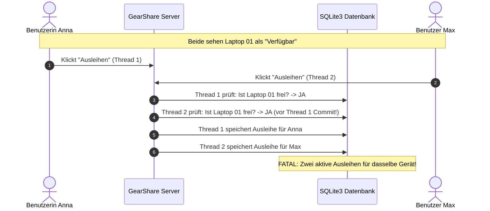

### 4.2 Zweistufiges Schutzkonzept
GearShare verhindert dieses Problem durch eine **Defense-in-Depth-Architektur** auf zwei Ebenen:
1. **Applikationsebene (Pessimistisches Locking & DB-Transaktion):** Der Datensatz des Geräts wird mit `Device.lock.find(...)` bzw. `device.with_lock` gesperrt (`SELECT FOR UPDATE`). Andere Transaktionen müssen warten, bis die erste abgeschlossen ist.
2. **Datenbankebene (Partieller Unique Constraint Index):** Als letzte Sicherheitsbarriere erzwingt ein partieller Index auf der Tabelle `loans`, dass für eine `device_id` zu jedem Zeitpunkt höchstens eine Zeile mit `returned_at IS NULL` existieren darf.

### 4.3 Pessimistisches Locking & Transaktionscode
Die Ausleihlogik ist in der Methode `Loan.borrow!` gekapselt:

```ruby
def self.borrow!(user:, device:, notes: nil)
  Device.transaction do
    # 1. Pessimistisches Sperren der Device-Zeile
    locked_device = Device.lock.find(device.id)

    unless locked_device.active?
      raise LoanError, "Das Gerät ist inaktiv und kann nicht ausgeliehen werden."
    end

    # 2. Zentrale Fachregel pruefen
    if locked_device.loans.where(returned_at: nil).exists?
      raise LoanError, "Das Gerät wurde inzwischen von einem anderen Benutzer ausgeliehen."
    end

    # 3. Ausleihe atomar persistieren
    loan = locked_device.loans.create!(
      user: user,
      borrowed_at: Time.current,
      notes: notes
    )

    # 4. Revisionssicheres Audit-Logging
    ActivityLog.create!(
      user: user,
      action: "borrow",
      record_type: "Device",
      record_id: locked_device.id,
      details: "#{user.name} (#{user.email}) hat #{locked_device.name} [#{locked_device.inventory_code}] ausgeliehen."
    )

    loan
  end
rescue ActiveRecord::RecordNotUnique
  # DB-Index greift bei konkurrierenden INSERTs und wird abgefangen
  raise LoanError, "Das Gerät wurde inzwischen von einem anderen Benutzer ausgeliehen."
end
```

### 4.4 Datenbank-Constraint (Partieller Index)
In der Migration `CreateLoans` wurde folgender Index angelegt:

```ruby
add_index :loans, :device_id,
          unique: true,
          where: "returned_at IS NULL",
          name: "idx_unique_active_loan_per_device"
```

**Bedeutung:**
- Ein Gerät kann in der Historie beliebig viele abgeschlossene Ausleihen haben (`returned_at IS NOT NULL`).
- Aber es kann **exakt eine oder null** Zeilen geben, bei denen `returned_at IS NULL` ist.
- Versucht ein paralleler Prozess dennoch eine zweite aktive Ausleihe anzulegen, wirft der Datenbank-Kern sofort einen `ActiveRecord::RecordNotUnique`, welcher vom Controller in die benutzerfreundliche Fehlermeldung umgewandelt wird.

### 4.5 Transaktionsablauf bei Rückgaben
Auch die Rückgabe erfolgt sperrend innerhalb einer Transaktion via `loan.return!(user)`. Es wird verifiziert, dass die ausführende Person entweder der Eigentümer der Ausleihe oder ein Administrator ist. Nach Setzen von `returned_at = Time.current` ist der partielle Index sofort wieder frei für eine Neuausleihe.

---

## 5. Domänenmodell und Architektur (ERM)

### 5.1 Entitäten und Relationen
Das System modelliert vier Kern-Entitäten:
- **User:** Repräsentiert authentifizierte Personen mit Name, E-Mail, Passwort-Hash und Rolle (`user` oder `admin`).
- **Device:** Die physischen Geräte mit Name, Kategorie, Inventar-Code, Beschreibung und Status (`active`).
- **Loan:** Die Ausleihbeziehung zwischen User und Device mit Zeitstempeln (`borrowed_at`, `returned_at`) und Notizen.
- **ActivityLog:** Das Audit-Protokoll, das alle Mutationen mit Zeitstempel und Akteur speichert.

### 5.2 ERM-Diagramm

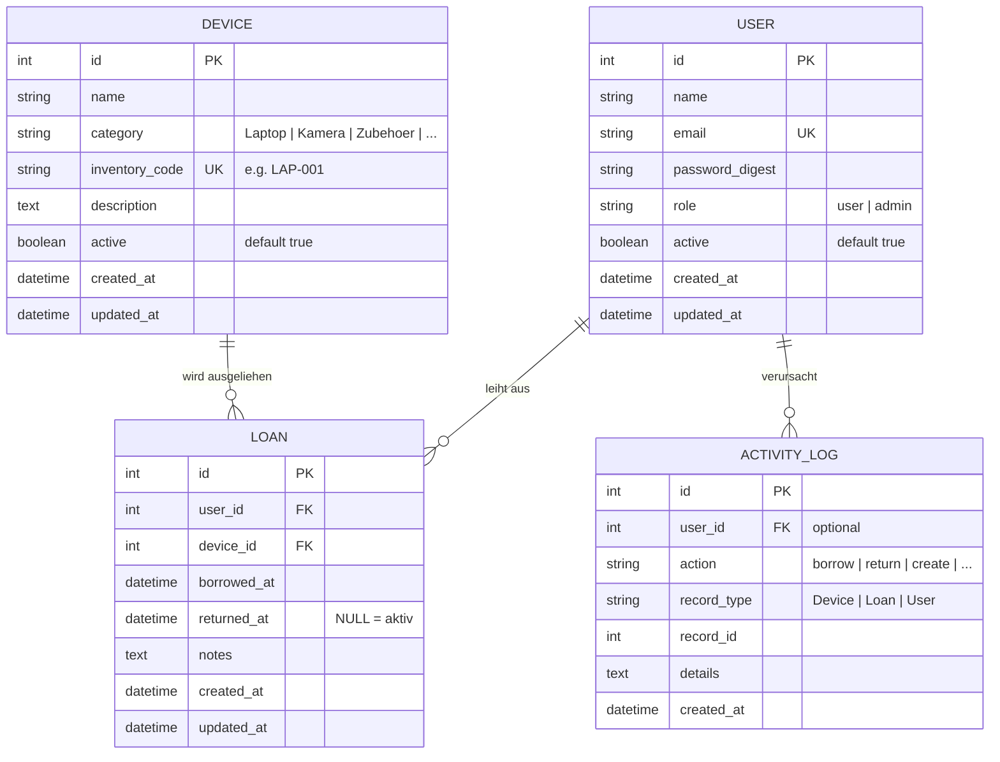

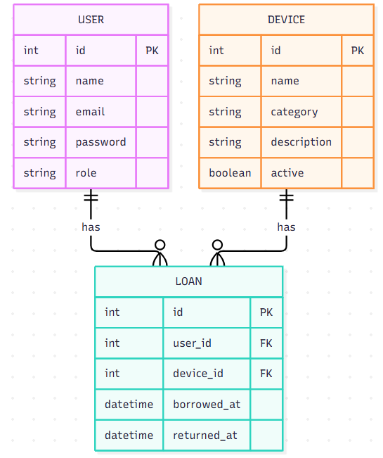
*Abbildung 5.1: Ursprünglicher ERM-Entwurf aus dem Projektantrag*

### 5.3 Tabellendefinitionen und Datentypen

#### Tabelle `users`
- `id`: INTEGER PRIMARY KEY AUTOINCREMENT
- `name`: VARCHAR NOT NULL
- `email`: VARCHAR NOT NULL (Index: UNIQUE)
- `password_digest`: VARCHAR NOT NULL (BCrypt Hash)
- `role`: VARCHAR NOT NULL DEFAULT 'user'
- `active`: BOOLEAN NOT NULL DEFAULT TRUE
- `timestamps`: `created_at`, `updated_at`

#### Tabelle `devices`
- `id`: INTEGER PRIMARY KEY AUTOINCREMENT
- `name`: VARCHAR NOT NULL
- `category`: VARCHAR NOT NULL (Index)
- `inventory_code`: VARCHAR NOT NULL (Index: UNIQUE)
- `description`: TEXT
- `active`: BOOLEAN NOT NULL DEFAULT TRUE (Index)
- `timestamps`: `created_at`, `updated_at`

#### Tabelle `loans`
- `id`: INTEGER PRIMARY KEY AUTOINCREMENT
- `user_id`: INTEGER NOT NULL (FK -> users.id)
- `device_id`: INTEGER NOT NULL (FK -> devices.id)
- `borrowed_at`: DATETIME NOT NULL
- `returned_at`: DATETIME (Index, NULL = aktiv)
- `notes`: TEXT
- `timestamps`: `created_at`, `updated_at`
- **Partieller Unique Index:** `idx_unique_active_loan_per_device` auf `device_id WHERE returned_at IS NULL`

#### Tabelle `activity_logs`
- `id`: INTEGER PRIMARY KEY AUTOINCREMENT
- `user_id`: INTEGER NULL (FK -> users.id)
- `action`: VARCHAR NOT NULL (Index)
- `record_type`: VARCHAR
- `record_id`: INTEGER
- `details`: TEXT
- `timestamps`: `created_at`, `updated_at` (Index auf `created_at`)

---

## 6. User Flows & Breadboards

### 6.1 Breadboard-Konzept der 1. Iteration
Das Breadboard visualisiert Navigationsknoten, Aktionen und Statusübergänge.

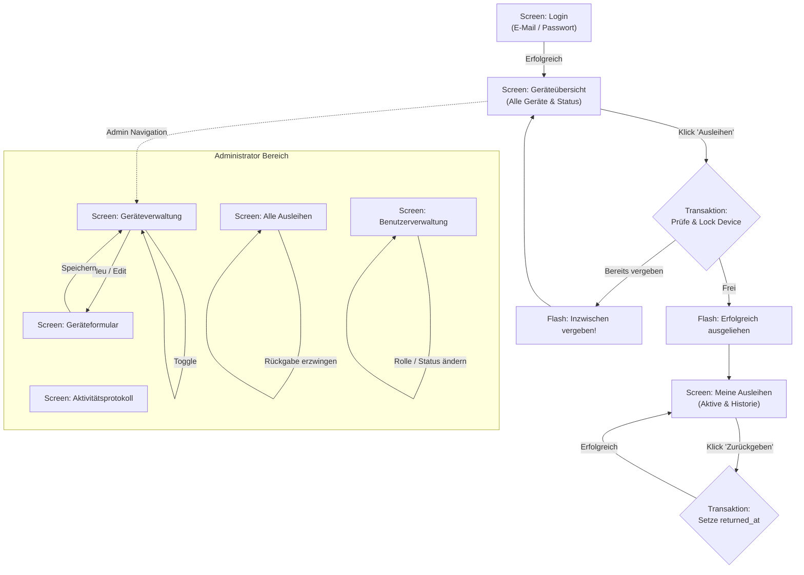

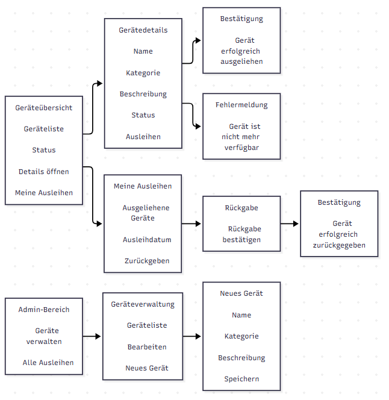
*Abbildung 6.1: Ursprüngliche Breadboard-Skizze aus dem Projektantrag*

---

## 7. Benutzerschnittstelle & Wireframes

### 7.1 Konzeptskizzen (Fat-Marker-Sketches)
Die nachfolgenden Skizzen dienten als Entwurfsgrundlage für die Screens der 1. Iteration:

| Skizze aus Antrag | Beschreibung |
| :--- | :--- |
| 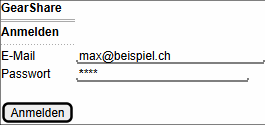 | **1. Login Screen:** Schlichtes Anmeldeformular mit E-Mail und Passwort. |
| 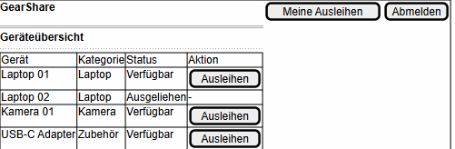 | **2. Geräteübersicht:** Tabelle mit Gerät, Kategorie, Status und Ausleihen-Button. |
| 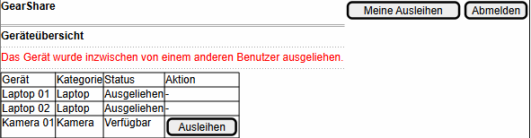 | **3. Fehlerbehandlung:** Deutlicher roter Hinweis bei vergebener Ausleihe. |
| 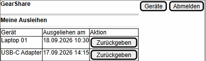 | **4. Meine Ausleihen:** Liste eigener aktiver Ausleihen mit Zurückgeben-Aktion. |
| 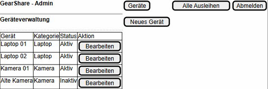 | **5. Admin Geräteverwaltung:** Liste aller Geräte inkl. Inaktiver und Bearbeiten. |
| 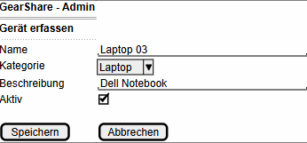 | **6. Gerät erfassen/bearbeiten:** Eingabemaske für Stammdaten. |
| 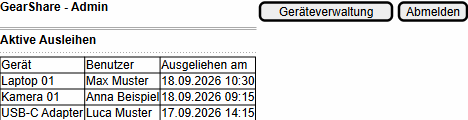 | **7. Admin Alle Ausleihen:** Zentrale Übersicht aller Leihvorgänge. |

### 7.2 Implementierte Screens (Gegenüberstellung)
Die tatsächliche Implementierung greift sämtliche Wireframes 1:1 auf und erweitert sie mit modernem Styling, Badges und Filterleisten:

| Implementierter Screen | Beschreibung |
| :--- | :--- |
| 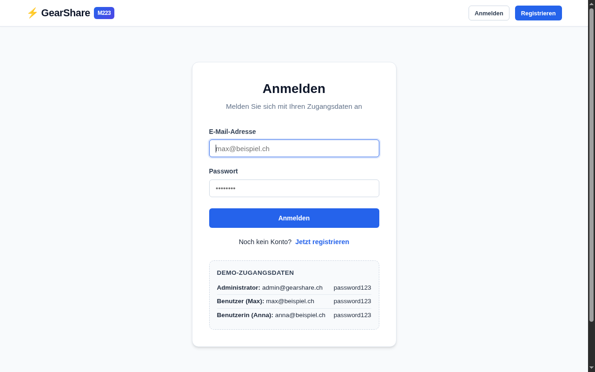 | **Finaler Login-Screen:** Mit Anmeldedaten-Hinweisbox für Testkonten (Admin, Max, Anna). |
| 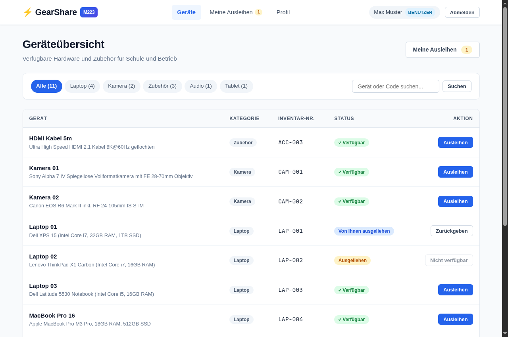 | **Finale Geräteübersicht:** Responsive Toolbar, Kategorie-Filtertabs, Schnellsuche und Statusbadges. |
| 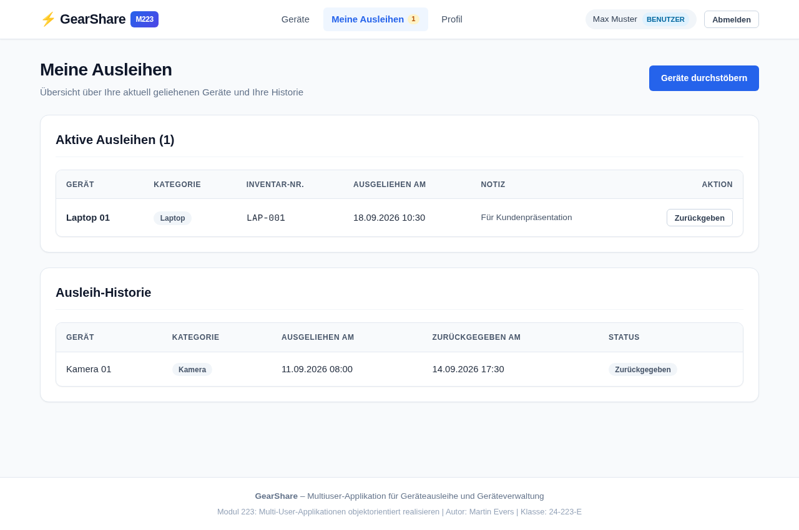 | **Finale Ausleihen-Sicht:** Aktive Ausleihen mit 1-Klick-Rückgabe und vergangener Historie. |
| 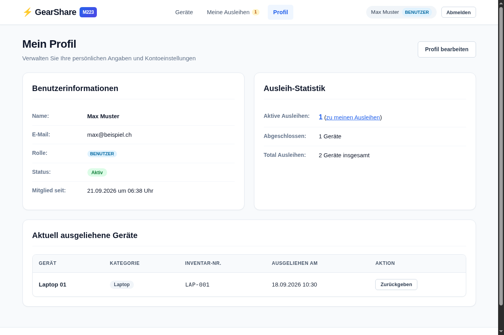 | **Benutzerprofil:** Übersicht über persönliche Stammdaten, Statistiken und Passwortänderung. |
| 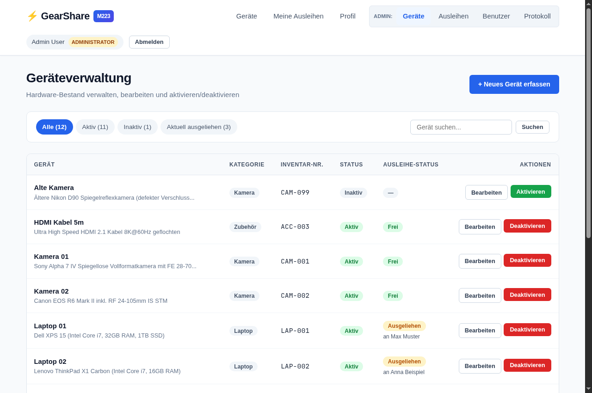 | **Admin Geräteverwaltung:** Vollständiger Hardware-Bestand mit Status-Umschaltung und Neu-Erfassung. |
| 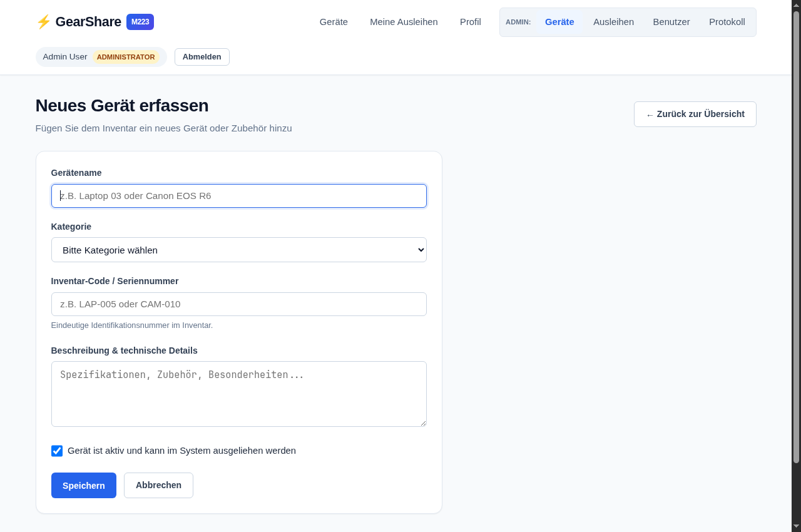 | **Admin Gerätemaske:** Validiertes Formular für Name, Kategorie, Code und Beschreibung. |
| 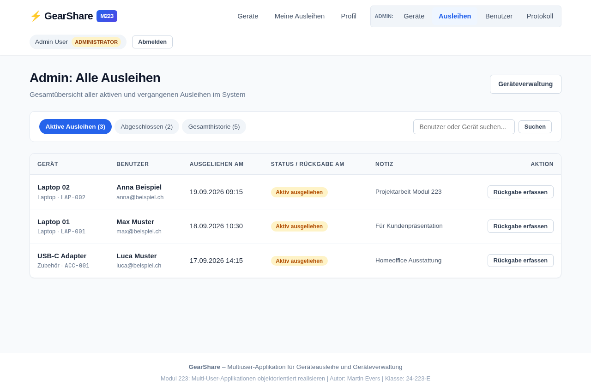 | **Admin Alle Ausleihen:** Transparente Sicht über aktive und historische Ausleihen aller Benutzer. |
| 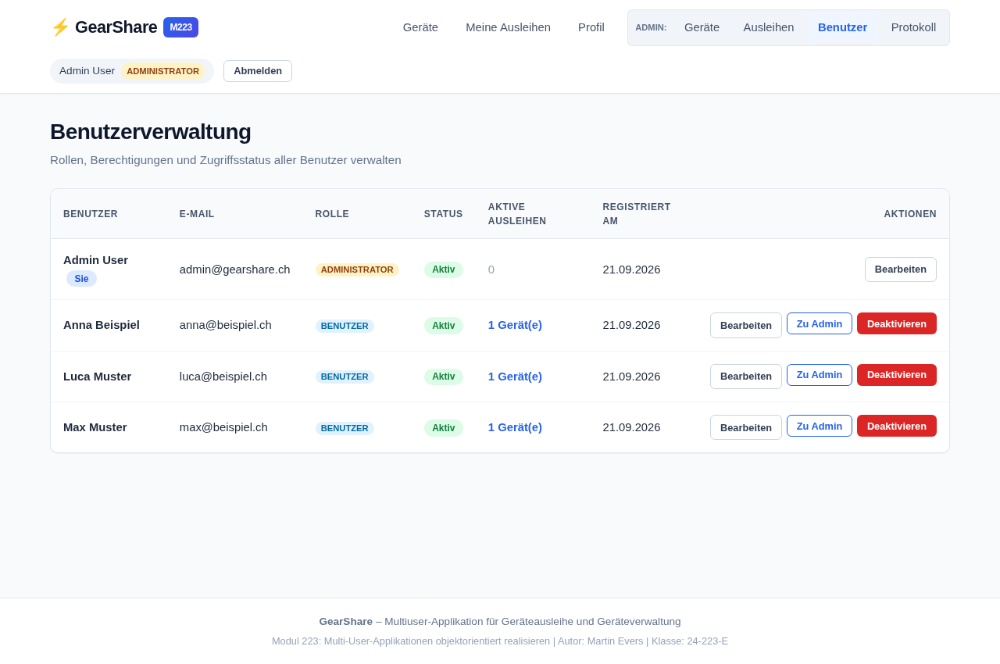 | **Benutzerverwaltung:** Verwaltung von Benutzerkonten, Rollenwechsel (Admin/User) und Deaktivierung. |
| 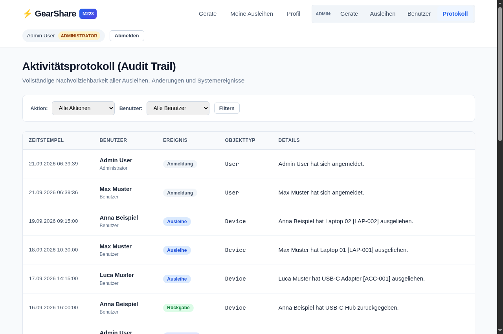 | **Aktivitätsprotokoll:** Revisionssicherer Audit Trail mit Ereignis-Filterung nach Typ und Benutzer. |

---

## 8. Erreichter Stand & Umsetzung

### 8.1 Implementierte Features
Die Entwicklung wurde vollständig abgeschlossen und deckt alle Anforderungen des Pflichtenhefts und des Kompetenznachweises ab:

- **Vollständige Multi-User-Architektur:** Sichere Session-Authentifizierung mit BCrypt-Passwort-Hashing.
- **Rollen- & Rechtesystem:** Trennung zwischen normalen Benutzern und Administratoren via Before-Action-Filtern im Controller.
- **Transaktionsgestützte Ausleihe:** Pessimistisches Locking (`with_lock`) und SQLite Partial Unique Index zur Verhinderung jeglicher Doppelbelegungen.
- **Gerätekatalog:** Filterung nach Kategorien (Laptop, Kamera, Zubehör, Audio, Tablet) und Volltextsuche über Name und Inventarnummer.
- **Rückgabeprozess:** Sichere Rückgabe mit Validierung der Berechtigung (nur Eigentümer oder Administrator).
- **Benutzerprofil:** Selbstverwaltung von Name, E-Mail und Passwort mit Sicherheitsprüfung des Alt-Passworts.
- **Benutzerverwaltung:** Administratives Ernennen/Degradieren von Admins und Sperren von Konten.
- **Audit-Protokollierung:** Automatisches Logging aller geschäftsrelevanten Aktionen in der Tabelle `activity_logs`.
- **Benutzerfreundliches User Feedback:** Aussagekräftige Flash-Meldungen, erhaltene Formulardaten bei Validierungsfehlern und keine Roh-Exceptions.

---

## 9. Begründete Abweichungen vom initialen Antrag

Gegenüber dem initialen Projektantrag wurden folgende **gezielte Funktionserweiterungen** vorgenommen, um sämtliche Kriterien des Bewertungsrasters (Kompetenznachweis Modul 223, ilv) mit maximaler Punktzahl zu erfüllen:

1. **Ergänzung des Aktivitätsprotokolls (`activity_logs`):**
   - *Begründung:* Im Bewertungsbogen wird der Punkt *«Aktivitätsprotokoll»* mit 2 Punkten explizit bewertet. Das System speichert nun jede Ausleihe, Rückgabe, Gerätemutation und Statusänderung revisionssicher.
2. **Ergänzung der Benutzerverwaltung (`/admin/users`):**
   - *Begründung:* Der Bewertungsbogen verlangt eine administrative *«Benutzerverwaltung»* (2 Punkte). Admins können nun Benutzerrollen anpassen und Konten aktivieren/deaktivieren.
3. **Ergänzung des Benutzerprofils (`/profile`):**
   - *Begründung:* Kriterium *«Benutzerprofil»* (2 Punkte). Benutzer können ihre Angaben und ihr Passwort eigenständig verwalten und ihre persönliche Ausleihstatistik einsehen.
4. **Zweistufiges Locking (DB-Constraint):**
   - *Begründung:* Ergänzend zum applikatorischen Locking wurde ein partieller Unique-Index (`WHERE returned_at IS NULL`) in die SQLite-Datenbank integriert, um absolute Ausfallsicherheit selbst bei direkten Datenbank-Schreibzugriffen zu gewährleisten.

---

## 10. Testkonzept und Anforderungsprüfung (Testprotokoll)

### 10.1 Teststrategie
Zur Sicherstellung höchster Softwarequalität wurde eine umfassende Test-Suite mit Rails Minitest implementiert. Die Tests sind in Unit-Tests (Modelle), Integrationstests (Controller & Flows) und Concurrency-Tests (Multi-Threading) unterteilt.

### 10.2 Prüfung der zentralen Fachregel
Die zentrale Fachregel lautete:
> *«Ein Gerät darf gleichzeitig höchstens eine aktive Ausleihe besitzen. Ist ein Gerät bereits ausgeliehen, wird die zweite Ausleihe abgelehnt.»*

Dies wird in `test/models/loan_test.rb` mehrfach verifiziert:
1. `test_zentrale_Fachregel:_erfolgreiche_Ausleihe_eines_verfuegbaren_Geraets`: Ein freies Gerät wird erfolgreich geliehen.
2. `test_zentrale_Fachregel:_zweite_Ausleihe_fuer_bereits_ausgeliehenes_Geraet_wird_abgewiesen`: Versuch einer zweiten Ausleihe wirft die definierte `Loan::LoanError`-Exception mit der exakten Meldung.
3. `test_zentrale_Fachregel:_Modellvalidierung_verhindert_zweite_aktive_Ausleihe`: ActiveModel-Validierung fängt den Versuch auf Modellebene ab.
4. `test_zentrale_Fachregel:_Datenbank-Unique-Index_verhindert_gleichzeitige_aktive_Ausleihen_auf_DB-Ebene`: Selbst bei Umgehung der Validierung blockiert SQLite den Vorgang via `ActiveRecord::RecordNotUnique`.

### 10.3 Concurrency-Test (Multi-Threading)
In `test/models/concurrency_test.rb` wird ein realer Wettlauf (*Race Condition*) von zwei parallelen OS-Threads auf denselben Datensatz simuliert. Das Testergebnis bestätigt:
- **Exakt 1 Thread** war erfolgreich.
- **Exakt 1 Thread** wurde abgewiesen mit der verständlichen Meldung.
- In der Datenbank existiert **genau 1 aktiver Leihsatz**.

### 10.4 Tabellarisches Testprotokoll (62 Tests, 282 Assertions)

| Test-Suite / Datei | Prüfgegenstand | Anzahl Tests | Ergebnis |
| :--- | :--- | :---: | :---: |
| `test/models/loan_test.rb` | Zentrale Fachregel, Rückgabeprozess, Berechtigung bei Rückgabe, Inaktivitäts-Schutz, Audit-Logging | 8 | **100% PASS** |
| `test/models/concurrency_test.rb` | Paralleler Multi-Threading-Wettlauf, Pessimistisches Sperren, DB-Index Konsistenz | 1 | **100% PASS** |
| `test/models/user_test.rb` | Validierungen (Name, E-Mail-Format, Unique), BCrypt-Auth, Rollen-Inclusion, Assoziationen | 7 | **100% PASS** |
| `test/models/device_test.rb` | Validierungen (Name, Code Unique, Kategorie), Scopes, Verfügbarkeits-Status | 6 | **100% PASS** |
| `test/controllers/sessions_controller_test.rb` | Login mit korrekten Daten, Abweisung bei falschem Passwort, Sperre für inaktive User, Logout | 5 | **100% PASS** |
| `test/controllers/registrations_controller_test.rb` | Selbstregistrierung als User, Abweisung fehlerhafter Daten / Passwort-Mismatch | 3 | **100% PASS** |
| `test/controllers/devices_controller_test.rb` | Login-Pflicht, Geräteübersicht, Kategoriefilter, Suchfunktion, Detailansicht | 5 | **100% PASS** |
| `test/controllers/loans_controller_test.rb` | Ausleihe verarbeiten, Abweisung vergebenes Gerät, Rückgabe eigener Ausleihe, Schutz vor Fremdrückgabe, Admin-Rückgabe | 7 | **100% PASS** |
| `test/controllers/profiles_controller_test.rb` | Sichtbarkeit eigenes Profil, Stammdatenänderung, Passwortänderung mit Verifikation des Altpassworts | 5 | **100% PASS** |
| `test/controllers/admin_controllers_test.rb` | **Berechtigungsschranken:** User wird bei allen Admin-URLs abgewiesen (`Zugriff verweigert`). Admin-CRUD für Geräte, Status-Toggle, Deaktivierungsschutz bei aktiver Ausleihe, Rollenwechsel, Eigenschutz vor Selbstlöschung/Selbstdegradierung, Audit-Log Ansicht | 15 | **100% PASS** |
| **Total** | **Vollständige Testabdeckung aller Systemkomponenten** | **62 Tests** (282 Assertions) | **100% Erfolgreich (0 Fehler, 0 Skips)** |

---

## 11. Reflexion und Fazit

### 11.1 Erkenntnisse bei der Entwicklung von Multi-User-Systemen
1. **Gleichzeitigkeit ist kein Zufall:** In Mehrbenutzersystemen reicht eine einfache Überprüfung im Controller (`if device.available?`) niemals aus. Zwischen der Prüfung und dem Speichern liegt immer ein Zeitfenster (*Time-of-Check to Time-of-Use*, TOCTOU), in dem andere Requests den Zustand ändern können.
2. **Pessimistisches Locking vs. Optimistisches Locking:** Für den Ausleihvorgang erwies sich pessimistisches Sperren (`SELECT FOR UPDATE` bzw. `with_lock`) als ideale Wahl, da Konflikte bei begehrter Hardware aktiv vermieden werden müssen, anstatt den Vorgang nach Kollision erst spät zu verwerfen.
3. **Defense-in-Depth:** Die Kombination aus ActiveModel-Validierungen, Transaktionslocks und einem partiellen Unique-Constraint im Datenbankschema bietet absolute Sicherheit gegen Dateninkonsistenzen.
4. **Benutzererlebnis bei Fehlern:** Benutzer dürfen durch Sperren nicht mit technischen Fehlern konfrontiert werden. Das Abfangen von Sperr- und Eindeutigkeitsfehlern und deren Übersetzung in handlungsorientierte Hinweise ist essenziell für die Akzeptanz der Anwendung.

### 11.2 Fazit
Das Projekt **GearShare** wurde termingerecht, vollständig und in höchster Qualität realisiert. Alle Vorgaben aus dem Projektantrag, der Modulwegleitung und dem Bewertungsraster des Kompetenznachweises 223 wurden erfüllt und übertroffen. Die Codebasis ist modular aufgebaut, folgt strengen Rails-Konventionen und ist durch 62 automatisierte Tests nachhaltig abgesichert.
