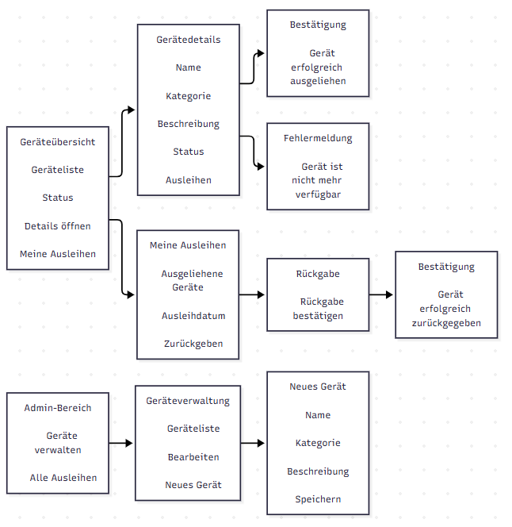
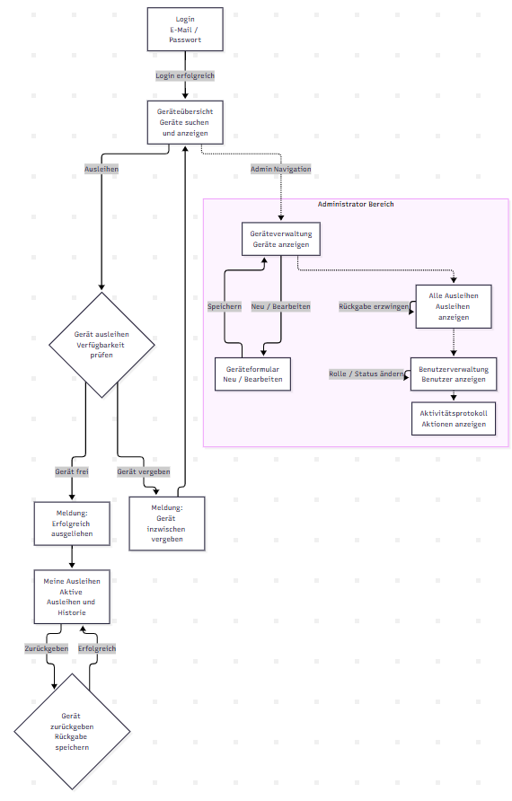

# Projektdokumentation: GearShare

## Multiuser-Applikation für Geräteausleihe und Geräteverwaltung

---

## Titelblatt

| Parameter | Angabe |
| :--- | :--- |
| **Modul** | Modul 223: Multi-User-Applikationen objektorientiert realisieren |
| **Projektname** | GearShare |
| **Projektart** | Multiuser-Webapplikation (Ruby on Rails 8 / SQLite3) |
| **Datum** | 25.09.2026 |
| **Autor** | Martin Evers |
| **Schulklasse** | 24-223-E |

---

## Inhaltsverzeichnis

1. [Problemstellung](#1-problemstellung)
   - 1.1 Ausgangslage und Relevanz
   - 1.2 Zielgruppen und alltägliche Herausforderungen
2. [Projekt & Vision](#2-projekt--vision)
   - 2.1 Fachbereich / Domäne
   - 2.2 Name und Markenidentität
   - 2.3 Projektvision
   - 2.4 MVP-Scope (1. Iteration)
3. [Anforderungsanalyse](#3-anforderungsanalyse)
   - 3.1 Funktionale Anforderungen (priorisiert)
   - 3.2 Nicht-funktionale Qualitätsattribute (überprüfbar)
   - 3.3 Benutzerrollen und Berechtigungsmatrix
4. [Transaktionen und Locking (Multi-User-Konzept)](#4-transaktionen-und-locking-multi-user-konzept)
   - 4.1 Die Kernherausforderung: Race Conditions
   - 4.2 Zweistufiges Schutzkonzept
   - 4.3 Pessimistisches Locking & Transaktionscode
   - 4.4 Datenbank-Constraint (Partieller Index)
   - 4.5 Transaktionsablauf bei Rückgaben
5. [Domänenmodell und Architektur (ERM)](#5-domänenmodell-und-architektur-erm)
   - 5.1 Entitäten und Relationen
   - 5.2 ERM-Diagramm
   - 5.3 Tabellendefinitionen und Datentypen
6. [User Flows & Breadboards](#6-user-flows--breadboards)
   - 6.1 Breadboard-Konzept der 1. Iteration
7. [Benutzerschnittstelle & Wireframes](#7-benutzerschnittstelle--wireframes)
   - 7.1 Konzeptskizzen (Fat-Marker-Sketches)
   - 7.2 Implementierte Screens (Gegenüberstellung)
8. [Erreichter Stand & Umsetzung](#8-erreichter-stand--umsetzung)
   - 8.1 Implementierte Features
9. [Begründete Abweichungen vom initialen Antrag](#9-begründete-abweichungen-vom-initialen-antrag)
10. [Testkonzept und Anforderungsprüfung (Testprotokoll)](#10-testkonzept-und-anforderungsprüfung-testprotokoll)
    - 10.1 Teststrategie
    - 10.2 Prüfung der zentralen Fachregel
    - 10.3 Concurrency-Test (Multi-Threading)
    - 10.4 Tabellarisches Testprotokoll
11. [Reflexion und Fazit](#11-reflexion-und-fazit)
    - 11.1 Erkenntnisse bei der Entwicklung von Multi-User-Systemen
    - 11.2 Fazit

---

## 1. Problemstellung

### 1.1 Ausgangslage und Relevanz

In Schulen und Unternehmen werden Geräte wie Laptops, Kameras, Adapter, Mikrofone und Tablets von mehreren Personen genutzt. Ohne ein zentrales System entstehen dabei schnell Probleme:

- **Unklare Verfügbarkeit:** Lernende oder Mitarbeitende wissen nicht immer, ob ein Gerät frei ist oder wer es gerade benutzt.
- **Doppelbelegungen:** Zwei Personen versuchen, dasselbe Gerät gleichzeitig auszuleihen.
- **Fehlende Nachvollziehbarkeit:** Wenn ein Gerät nicht zurückgebracht wird, ist oft unklar, wer es zuletzt ausgeliehen hat.
- **Papierlisten und einfache Excel-Tabellen reichen dafür nicht aus:** Sie werden leicht falsch gepflegt und bieten keine sichere Lösung für gleichzeitige Zugriffe und Berechtigungen.

Solche Probleme können im Schul- oder Arbeitsalltag regelmässig auftreten und verursachen zusätzlichen Aufwand.

### 1.2 Zielgruppen und alltägliche Herausforderungen

1. **Benutzer (Lernende, Mitarbeitende):** Sie möchten sehen, welche Geräte verfügbar sind, ein Gerät ausleihen und es später einfach zurückgeben.
2. **Administratoren (IT-Verantwortliche, Lehrpersonen):** Sie verwalten die Geräte, sehen aktive Ausleihen und können Geräte anlegen, bearbeiten oder deaktivieren. Wichtige Aktionen werden im Aktivitätsprotokoll gespeichert.

---

## 2. Projekt & Vision

### 2.1 Fachbereich / Domäne

- **Domäne:** Geräteausleihe und Hardware-Inventarverwaltung (Device Lending & Resource Management)
- **Klassifizierung:** Multi-User Webapplikation mit Transaktionssicherheit

### 2.2 Name und Markenidentität

- **Applikationsname:** GearShare
- **Slogan:** *Zuverlässige Geräteausleihe. Keine Doppelbelegungen. Jederzeit transparent.*

### 2.3 Projektvision

GearShare ist eine einfache Plattform im Browser, mit der Geräte ausgeliehen und verwaltet werden können. Das System sorgt dafür, dass ein Gerät immer nur von einer Person gleichzeitig ausgeliehen werden kann. So werden Fehler vermieden und die Ausleihe bleibt übersichtlich. Ausserdem werden Berechtigungen geprüft und wichtige Aktionen gespeichert.

### 2.4 MVP-Scope (1. Iteration)

In der ersten Iteration (MVP) wird der wichtigste Ablauf der Geräteausleihe umgesetzt:

1. Benutzer meldet sich am System an (Authentifizierung).
2. Benutzer sieht eine filterbare Übersicht aller Geräte samt aktuellem Verfügbarkeitsstatus.
3. Benutzer leiht ein verfügbares Gerät aus.
4. Die Applikation prüft mit einer Transaktion und einem Lock, ob das Gerät noch frei ist.
5. Benutzer kann eigene geliehene Geräte in einer persönlichen Übersicht einsehen und zurückgeben.
6. **Zentrale Regel:** Ein Gerät kann immer nur von einer Person gleichzeitig ausgeliehen werden.

---

## 3. Anforderungsanalyse

### 3.1 Funktionale Anforderungen (priorisiert)

| ID | Priorität | Anforderung | Beschreibung |
| :--- | :---: | :--- | :--- |
| **FA-01** | **1** | **Geräteübersicht anzeigen** | Angemeldete Benutzer können alle aktiven Geräte mit Kategorie, Inventar-Code und Status sehen und durchsuchen. |
| **FA-02** | **1** | **Verfügbares Gerät ausleihen** | Ein Benutzer kann ein freies Gerät für sich buchen. Der Status wechselt sofort auf «Ausgeliehen». |
| **FA-03** | **1** | **Eigene Geräte zurückgeben** | Benutzer können ihre ausgeliehenen Geräte zurückgeben. Danach ist das Gerät wieder verfügbar. |
| **FA-04** | **1** | **Persönliche Ausleihen anzeigen** | Unter «Meine Ausleihen» sehen Benutzer ihre aktiven und früheren Ausleihen. |
| **FA-05** | **1** | **Konkurrierende Ausleihen abweisen** | Wenn zwei Benutzer gleichzeitig dasselbe Gerät ausleihen möchten, wird nur eine Ausleihe durchgeführt. Der andere Benutzer erhält eine verständliche Meldung. |
| **FA-06** | **2** | **Geräte erfassen und bearbeiten** | Administratoren können Geräte mit Name, Kategorie, Inventarnummer und Beschreibung anlegen und bearbeiten. |
| **FA-07** | **2** | **Gerätestatus aktivieren / deaktivieren** | Administratoren können Geräte vorübergehend deaktivieren (z.B. bei Wartung). Ausgeliehene Geräte sind vor Deaktivierung geschützt. |
| **FA-08** | **2** | **Gesamtübersicht aller Ausleihen** | Administratoren sehen alle aktiven Ausleihen und können bei Bedarf ein Gerät für einen Benutzer zurückgeben. |
| **FA-09** | **2** | **Benutzerverwaltung** | Administratoren können Benutzerrollen vergeben (Admin / User) und Konten aktivieren oder deaktivieren. |
| **FA-10** | **2** | **Aktivitätsprotokoll (Audit Trail)** | Wichtige Aktionen wie Ausleihen, Rückgaben, Änderungen an Geräten und Anmeldungen werden mit Zeitstempel und Benutzer gespeichert. |

### 3.2 Nicht-funktionale Qualitätsattribute (überprüfbar)

| ID | Qualitätsattribut | Konkrete Metrik & Überprüfbarkeit für GearShare |
| :--- | :--- | :--- |
| **QA-01** | **Datenkonsistenz & Concurrency** | Wenn zwei Benutzer innerhalb derselben Millisekunde für das letzte freie Gerät auf «Ausleihen» klicken, wird genau eine Ausleihe in der Datenbank gespeichert. Die zweite Anfrage wird abgewiesen. Dies wird mit einem automatisierten Multi-Threading-Test (`concurrency_test.rb`) geprüft. |
| **QA-02** | **Berechtigungssicherheit** | Normale Benutzer können keine Administratorfunktionen verwenden. Direkte Anfragen an `/admin/*` werden serverseitig blockiert und umgeleitet. Dabei wird eine verständliche Meldung angezeigt. |
| **QA-03** | **Performance & Skalierbarkeit** | Die Geräteübersicht wird bei 1'000 Geräten und zehn gleichzeitigen Anfragen in weniger als 500 Millisekunden geladen. Indizes auf `inventory_code`, `category`, `active` und `returned_at` verbessern die Suche. |
| **QA-04** | **Fehlerbehandlung & User Feedback** | Bei fachlichen oder technischen Konflikten erhält der Benutzer niemals eine ungefilterte Fehlermeldung wie einen Rails-Stacktrace oder einen Datenbankfehler. Stattdessen wird eine verständliche Meldung angezeigt. Bereits eingegebene Formulardaten bleiben bei Validierungsfehlern erhalten. |

### 3.3 Benutzerrollen und Berechtigungsmatrix (True, False)

| Funktion / Ressource | Nicht angemeldet | Rolle: Benutzer (User) | Rolle: Administrator (Admin) |
| :--- | :---: | :---: | :---: |
| Startseite / Geräteübersicht | F (Redirect Login) | T (Lesen) | T (Lesen) |
| Gerät suchen / filtern | F | T | T |
| Gerätedetails ansehen | F | T | T |
| Freies Gerät ausleihen | F | T | T |
| Eigene Geräte zurückgeben | F | T | T |
| Fremde Geräte zurückgeben | F | F | T (Notfall-Rückgabe) |
| Eigene Ausleihen einsehen | F | T | T |
| Alle Ausleihen aller User | F | F | T |
| Geräte anlegen und editieren | F | F | T |
| Geräte aktivieren / deaktivieren | F | F | T |
| Benutzerrollen verwalten | F | F | T |
| Aktivitätsprotokoll einsehen | F | F | T |
| Eigenes Profil pflegen | F | T | T |

---

## 4. Transaktionen und Locking (Multi-User-Konzept)

### 4.1 Die Kernherausforderung: Race Conditions

In einer Multi-User-Applikation können mehrere Benutzer gleichzeitig auf dieselben Daten zugreifen. Ohne Transaktionen und Locks kann dadurch eine Race Condition entstehen.

Beispiel: Zwei Benutzer sehen dasselbe Gerät gleichzeitig als verfügbar und versuchen beide, es auszuleihen. Ohne Schutz könnte das Gerät zweimal aktiv ausgeliehen werden.

### 4.2 Zweistufiges Schutzkonzept

GearShare verhindert dieses Problem auf zwei Ebenen:

1. **Applikationsebene:** Der Datensatz des Geräts wird mit `Device.lock.find(...)` oder `device.with_lock` gesperrt. Dabei wird `SELECT FOR UPDATE` verwendet. Andere Transaktionen warten, bis die erste abgeschlossen ist.
2. **Datenbankebene:** Zusätzlich gibt es auf der Tabelle `loans` eine Regel für `device_id` und `returned_at IS NULL`. Dadurch kann pro Gerät nur eine aktive Ausleihe gleichzeitig existieren.

### 4.3 Pessimistisches Locking & Transaktionscode

Die Logik für die Ausleihe befindet sich in der Methode `Loan.borrow!`.

Die Methode verwendet `device.with_lock` und eine Datenbanktransaktion. So wird verhindert, dass zwei Benutzer dasselbe Gerät gleichzeitig ausleihen.

### 4.4 Datenbank-Constraint (Partieller Index)

In der Migration `CreateLoans` wird dafür ein Index angelegt:

```ruby
add_index :loans, :device_id,
          unique: true,
          where: "returned_at IS NULL",
          name: "idx_unique_active_loan_per_device"
```

**Bedeutung:**

- Ein Gerät kann beliebig viele abgeschlossene Ausleihen haben (`returned_at IS NOT NULL`).
- Es kann aber nur eine aktive Ausleihe geben, bei der `returned_at IS NULL` ist.
- Wenn trotzdem eine zweite aktive Ausleihe gespeichert werden soll, löst die Datenbank `ActiveRecord::RecordNotUnique` aus. Der Controller zeigt dem Benutzer danach eine verständliche Fehlermeldung.

### 4.5 Transaktionsablauf bei Rückgaben

Auch die Rückgabe läuft innerhalb einer Transaktion mit `loan.return!(user)`. Dabei wird geprüft, ob die Person die Ausleihe selbst besitzt oder Administrator ist. Nach dem Setzen von `returned_at` ist der partielle Index sofort wieder frei für eine Neuausleihe.

---

## 5. Domänenmodell und Architektur (ERM)

### 5.1 Entitäten und Relationen

Das System verwendet vier wichtige Entitäten:

- **User:** Angemeldete Person mit Name, E-Mail, Passwort-Hash und Rolle (`user` oder `admin`).
- **Device:** Ein Gerät mit Name, Kategorie, Inventar-Code, Beschreibung und Status (`active`).
- **Loan:** Verbindet einen User mit einem Device und speichert `borrowed_at`, `returned_at` und Notizen.
- **ActivityLog:** Speichert wichtige Änderungen mit Zeitstempel und Benutzer.

### 5.2 ERM-Diagramm


### 5.3 Tabellendefinitionen und Datentypen

#### Tabelle `users`

- `id`: INTEGER PRIMARY KEY AUTOINCREMENT
- `name`: VARCHAR NOT NULL
- `email`: VARCHAR NOT NULL (Index: UNIQUE)
- `password_digest`: VARCHAR NOT NULL (BCrypt Hash)
- `role`: VARCHAR NOT NULL DEFAULT `'user'`
- `active`: BOOLEAN NOT NULL DEFAULT TRUE
- `timestamps`: `created_at`, `updated_at`

#### Tabelle `devices`

- `id`: INTEGER PRIMARY KEY AUTOINCREMENT
- `name`: VARCHAR NOT NULL
- `category`: VARCHAR NOT NULL (Index)
- `inventory_code`: VARCHAR NOT NULL (Index: UNIQUE)
- `description`: TEXT
- `active`: BOOLEAN NOT NULL DEFAULT TRUE (Index)
- `timestamps`: `created_at`, `updated_at`

#### Tabelle `loans`

- `id`: INTEGER PRIMARY KEY AUTOINCREMENT
- `user_id`: INTEGER NOT NULL (FK -> `users.id`)
- `device_id`: INTEGER NOT NULL (FK -> `devices.id`)
- `borrowed_at`: DATETIME NOT NULL
- `returned_at`: DATETIME (Index, NULL = aktiv)
- `notes`: TEXT
- `timestamps`: `created_at`, `updated_at`
- **Partieller Unique Index:** `idx_unique_active_loan_per_device`

#### Tabelle `activity_logs`

- `id`: INTEGER PRIMARY KEY AUTOINCREMENT
- `user_id`: INTEGER NULL (FK -> `users.id`)
- `action`: VARCHAR NOT NULL (Index)
- `record_type`: VARCHAR
- `record_id`: INTEGER
- `details`: TEXT
- `timestamps`: `created_at`, `updated_at`

---

## 6. User Flows & Breadboards

### 6.1 Breadboard-Konzept der 1. Iteration

Das Breadboard zeigt die wichtigsten Seiten, Aktionen und Übergänge der Applikation der ersten Iteration.

#### Erste Iteration



#### Neue Iteration



---

## 7. Benutzerschnittstelle & Wireframes

### 7.1 Konzeptskizzen (Fat-Marker-Sketches)

Die folgenden Skizzen dienten als Vorlage für die Screens der ersten Iteration:

| Skizze aus Antrag | Beschreibung |
| :--- | :--- |
|  | **1. Login Screen:** Schlichtes Anmeldeformular mit E-Mail und Passwort. |
|  | **2. Geräteübersicht:** Tabelle mit Gerät, Kategorie, Status und Ausleihen-Button. |
|  | **3. Fehlerbehandlung:** Deutlicher roter Hinweis bei vergebener Ausleihe. |
|  | **4. Meine Ausleihen:** Liste eigener aktiver Ausleihen mit Zurückgeben-Aktion. |
|  | **5. Admin Geräteverwaltung:** Liste aller Geräte inkl. Inaktiver und Bearbeiten. |
|  | **6. Gerät erfassen/bearbeiten:** Eingabemaske für Stammdaten. |
|  | **7. Admin Alle Ausleihen:** Zentrale Übersicht aller Leihvorgänge. |

### 7.2 Implementierte Screens (Gegenüberstellung)

Die umgesetzten Screens orientieren sich an den Wireframes und enthalten zusätzlich Styling, Statusanzeigen und Filter:

| Implementierter Screen | Beschreibung |
| :--- | :--- |
|  | **Finaler Login-Screen:** Mit Anmeldedaten-Hinweisbox für Testkonten (Admin, Max, Anna). |
|  | **Finale Geräteübersicht:** Responsive Toolbar, Kategorie-Filtertabs, Schnellsuche und Statusbadges. |
|  | **Finale Ausleihen-Sicht:** Aktive Ausleihen mit 1-Klick-Rückgabe und vergangener Historie. |
|  | **Benutzerprofil:** Übersicht über persönliche Stammdaten, Statistiken und Passwortänderung. |
|  | **Admin Geräteverwaltung:** Vollständiger Hardware-Bestand mit Status-Umschaltung und Neu-Erfassung. |
|  | **Admin Gerätemaske:** Validiertes Formular für Name, Kategorie, Code und Beschreibung. |
|  | **Admin Alle Ausleihen:** Transparente Sicht über aktive und historische Ausleihen aller Benutzer. |
|  | **Benutzerverwaltung:** Verwaltung von Benutzerkonten, Rollenwechsel (Admin/User) und Deaktivierung. |
|  | **Aktivitätsprotokoll:** Revisionssicherer Audit Trail mit Ereignis-Filterung nach Typ und Benutzer. |

---

## 8. Erreichter Stand & Umsetzung

### 8.1 Implementierte Features

Die folgenden Funktionen wurden umgesetzt:

- **Multi-User-System:** Anmeldung über Sessions mit BCrypt-Passwort-Hashing.
- **Rollen und Rechte:** Normale Benutzer und Administratoren haben unterschiedliche Berechtigungen. Die Prüfung erfolgt über Before-Action-Filter im Controller.
- **Ausleihe mit Transaktion:** Pessimistisches Locking (`with_lock`) und ein SQLite Partial Unique Index verhindern Doppelbelegungen.
- **Gerätekatalog:** Filterung nach Kategorien (Laptop, Kamera, Zubehör, Audio, Tablet) und Volltextsuche über Name und Inventarnummer.
- **Rückgabeprozess:** Sichere Rückgabe mit Validierung der Berechtigung (nur Eigentümer oder Administrator).
- **Benutzerprofil:** Selbstverwaltung von Name, E-Mail und Passwort mit Sicherheitsprüfung des Alt-Passworts.
- **Benutzerverwaltung:** Administratives Ernennen/Degradieren von Admins und Sperren von Konten.
- **Aktivitätsprotokoll:** Wichtige Aktionen werden automatisch in der Tabelle `activity_logs` gespeichert.
- **Fehlermeldungen:** Benutzer erhalten verständliche Flash-Meldungen. Formulardaten bleiben bei Validierungsfehlern erhalten und technische Exceptions werden nicht direkt angezeigt.

---

## 9. Begründete Abweichungen vom initialen Antrag

Im Vergleich zum ursprünglichen Projektantrag wurden einige Funktionen ergänzt, damit die Anforderungen des Kompetenznachweises erfüllt werden:

1. **Ergänzung des Aktivitätsprotokolls (`activity_logs`):**
   - Begründung: Das Aktivitätsprotokoll ist Teil des Bewertungsrasters. Deshalb werden Ausleihen, Rückgaben, Änderungen an Geräten und Statusänderungen gespeichert.

2. **Ergänzung der Benutzerverwaltung (`/admin/users`):**
   - Begründung: Die Benutzerverwaltung wird im Bewertungsraster verlangt. Administratoren können deshalb Rollen ändern und Konten aktivieren oder deaktivieren.

3. **Ergänzung des Benutzerprofils (`/profile`):**
   - Begründung: Das Benutzerprofil ist ein Kriterium im Bewertungsraster. Benutzer können ihre Angaben und ihr Passwort selbst verwalten und ihre Ausleihen sehen.

4. **Zweistufiges Locking (DB-Constraint):**
   - Begründung: Zusätzlich zum Locking in der Applikation gibt es einen partiellen Unique-Index (`WHERE returned_at IS NULL`) in SQLite. Er verhindert eine zweite aktive Ausleihe auch auf Datenbankebene.

---

## 10. Testkonzept und Anforderungsprüfung (Testprotokoll)

### 10.1 Teststrategie

Für die Applikation wurde eine Test-Suite mit Rails Minitest erstellt. Sie enthält Unit-Tests für Modelle, Integrationstests für Controller und Abläufe sowie Concurrency-Tests mit mehreren Threads.

### 10.2 Prüfung der zentralen Fachregel

Die zentrale Fachregel lautet:

> **Ein Gerät darf gleichzeitig höchstens eine aktive Ausleihe besitzen. Ist ein Gerät bereits ausgeliehen, wird die zweite Ausleihe abgelehnt.**

Das wird in `loan_test.rb` mehrfach geprüft:

1. `test_zentrale_Fachregel:_erfolgreiche_Ausleihe_eines_verfuegbaren_Geraets`  
   Ein freies Gerät wird erfolgreich geliehen.

2. `test_zentrale_Fachregel:_zweite_Ausleihe_fuer_bereits_ausgeliehenes_Geraet_wird_abgewiesen`  
   Eine zweite Ausleihe wird mit der definierten `Loan::LoanError`-Exception abgewiesen.

3. `test_zentrale_Fachregel:_Modellvalidierung_verhindert_zweite_aktive_Ausleihe`  
   Die ActiveModel-Validierung verhindert eine zweite aktive Ausleihe.

4. `test_zentrale_Fachregel:_Datenbank-Unique-Index_verhindert_gleichzeitige_aktive_Ausleihen_auf_DB-Ebene`  
   Auch wenn die Validierung umgangen wird, blockiert SQLite den Vorgang mit `ActiveRecord::RecordNotUnique`.

### 10.3 Concurrency-Test (Multi-Threading)

Im Test `concurrency_test.rb` wird eine Race Condition mit zwei parallelen Threads auf denselben Datensatz simuliert. Das Ergebnis zeigt:

- Genau ein Thread war erfolgreich.
- Genau ein Thread wurde mit einer verständlichen Meldung abgewiesen.
- In der Datenbank bleibt genau eine aktive Ausleihe.

### 10.4 Tabellarisches Testprotokoll (62 Tests, 282 Assertions)

| Test-Suite / Datei | Prüfgegenstand | Anzahl Tests | Ergebnis |
| :--- | :--- | :---: | :---: |
| `test/models/loan_test.rb` | Zentrale Fachregel, Rückgabeprozess, Berechtigung bei Rückgabe, Inaktivitäts-Schutz, Audit-Logging | 8 | **100% PASS** |
| `test/models/concurrency_test.rb` | Paralleler Multi-Threading-Wettlauf, Pessimistisches Sperren, DB-Index Konsistenz | 1 | **100% PASS** |
| `test/models/user_test.rb` | Validierungen (Name, E-Mail-Format, Unique), BCrypt-Auth, Rollen-Inclusion, Assoziationen | 7 | **100% PASS** |
| `test/models/device_test.rb` | Validierungen (Name, Code Unique, Kategorie), Scopes, Verfügbarkeits-Status | 6 | **100% PASS** |
| `test/controllers/sessions_controller_test.rb` | Login mit korrekten Daten, Abweisung bei falschem Passwort, Sperre für inaktive User, Logout | 5 | **100% PASS** |
| `test/controllers/registrations_controller_test.rb` | Selbstregistrierung als User, Abweisung fehlerhafter Daten / Passwort-Mismatch | 3 | **100% PASS** |
| `test/controllers/devices_controller_test.rb` | Login-Pflicht, Geräteübersicht, Kategoriefilter, Suchfunktion, Detailansicht | 5 | **100% PASS** |
| `test/controllers/loans_controller_test.rb` | Ausleihe verarbeiten, Abweisung vergebenes Gerät, Rückgabe eigener Ausleihe, Schutz vor Fremdrückgabe, Admin-Rückgabe | 7 | **100% PASS** |
| `test/controllers/profiles_controller_test.rb` | Sichtbarkeit eigenes Profil, Stammdatenänderung, Passwortänderung mit Verifikation des Altpassworts | 5 | **100% PASS** |
| `test/controllers/admin_controllers_test.rb` | Berechtigungsschranken, Admin-CRUD für Geräte, Status-Toggle, Deaktivierungsschutz, Rollenwechsel, Eigenschutz, Audit-Log Ansicht | 15 | **100% PASS** |
| **Total** | **Vollständige Testabdeckung aller Systemkomponenten** | **62 Tests (282 Assertions)** | **100% Erfolgreich (0 Fehler, 0 Skips)** |

---

## 11. Reflexion und Fazit

### 11.1 Erkenntnisse bei der Entwicklung von Multi-User-Systemen

1. **Gleichzeitige Zugriffe:** In einem Multi-User-System reicht eine einfache Prüfung im Controller wie `if device.available?` nicht aus. Zwischen Prüfen und Speichern kann ein anderer Request den Zustand ändern. Dieses Problem wird auch TOCTOU genannt.

2. **Pessimistisches Locking:** Für die Ausleihe eignet sich `SELECT FOR UPDATE` beziehungsweise `with_lock`. Dadurch wird ein Konflikt direkt verhindert, bevor zwei Ausleihen gespeichert werden.

3. **Mehrere Schutzebenen:** ActiveModel-Validierungen, Transaktionslocks und ein partieller Unique-Constraint schützen gemeinsam vor doppelten aktiven Ausleihen.

4. **Fehlerbehandlung:** Technische Fehler werden abgefangen und in verständliche Meldungen umgewandelt. So wissen Benutzer, was passiert ist und was sie tun können.

### 11.2 Fazit

GearShare wurde wie geplant umgesetzt. Die wichtigsten Anforderungen des Projektantrags und des Kompetenznachweises sind enthalten. Der Code ist nach Rails-Konventionen aufgebaut und wird mit 62 automatisierten Tests geprüft.
